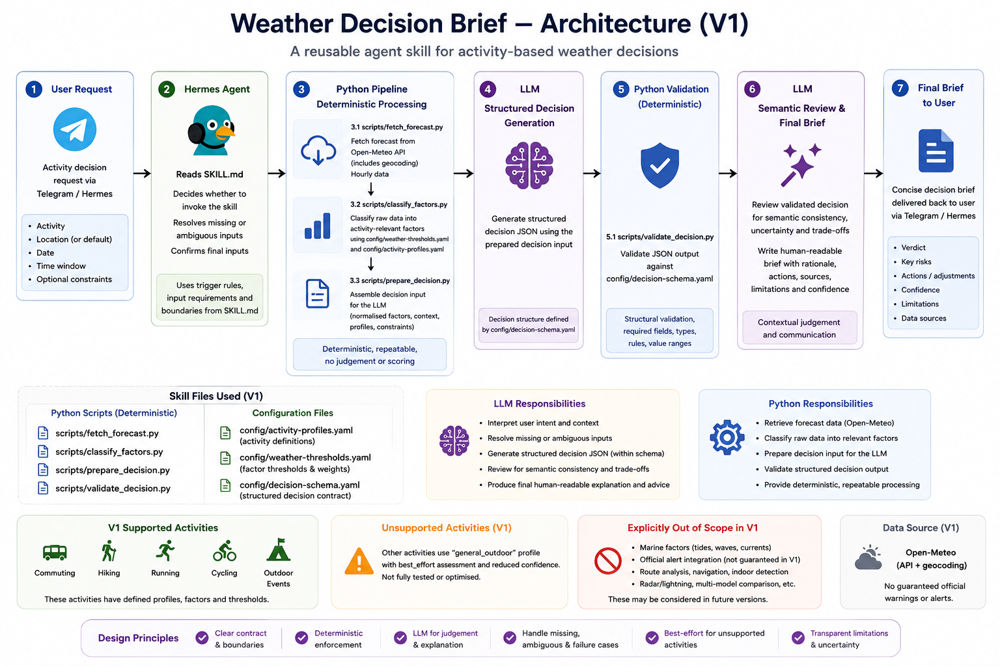
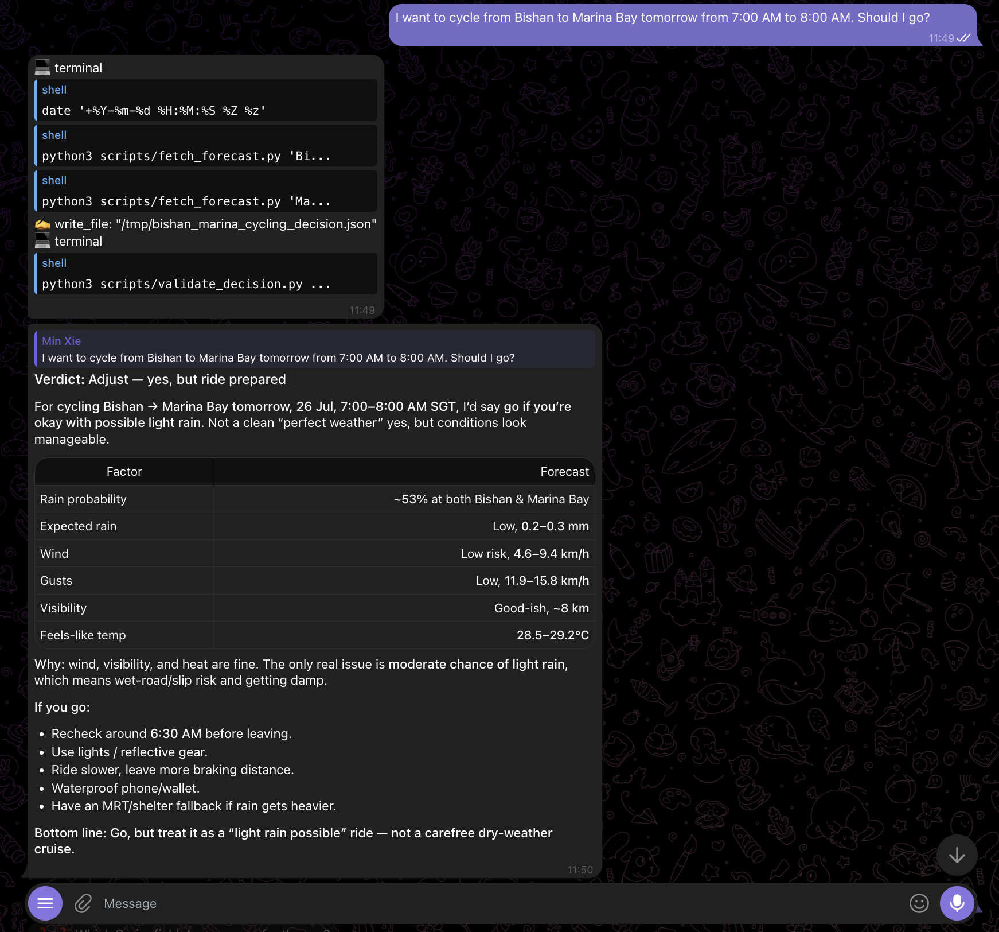

# Weather Decision Brief

## What It Does

Weather Decision Brief is a reusable agent skill that helps users decide whether and how to proceed with a planned activity based on forecast weather.

It combines deterministic Python processing with LLM judgment to produce one of four practical recommendations:

- `proceed`
- `adjust`
- `postpone`
- `insufficient_information`

The skill does more than repeat a forecast. It evaluates the relevant activity window, weather severity, activity profile, and optional personal constraints, then returns structured reasons, suggested actions, assumptions, and limitations.

## When to Use It

Use this skill when the user is asking for a weather-based decision about a planned activity.

Examples that should trigger the skill:

- Should I hike tomorrow from 8am to 11am?
- Is it sensible to cycle to work this evening?
- Should we postpone our outdoor event?
- Can I commute without bringing rain protection?

Do not use this skill for general weather questions without a decision.

Examples that should not trigger the skill:

- What is the weather tomorrow?
- What is Singapore’s climate like?
- What is the current temperature?

The skill requires a specific activity, location, date, and bounded start and end time before retrieving forecast data.

## Supported Activities

V1 includes dedicated profiles for:

- commuting
- hiking
- running
- cycling
- outdoor events

Each profile changes which weather factors matter most and how they are interpreted.

For example:

- hiking emphasizes trail conditions, exposure, heat, thunderstorms, and mobility constraints;
- cycling emphasizes wind, visibility, wet-road grip, braking, and heat;
- outdoor events emphasize setup, attendee exposure, equipment, and contingency planning.

Unsupported activities use the `general_outdoor` fallback profile with reduced confidence.

Marine activities such as kayaking are not fully supported because V1 does not include tide, wave, or current data.

## How It Works


The core design principle is:

> Use deterministic code for facts and consistency; use the LLM for contextual judgment.

The decision pipeline is:

1. The LLM interprets the user’s request and resolves the activity, location, date, time window, and optional constraints.
2. Python geocodes the location and retrieves hourly forecast data from Open-Meteo.
3. Python keeps only the requested activity window, calculates summaries, and classifies weather severity.
4. Python packages a consistent decision-input object.
5. The LLM weighs the evidence against the activity profile and user context.
6. Python validates the structured decision.
7. The LLM performs a semantic consistency review before presenting the final brief.

This separation keeps calculations repeatable while still allowing contextual recommendations.

See [`docs/architecture.md`](docs/architecture.md) for the detailed design.

## Runtime Proof

### 30-Second Demo

https://github.com/user-attachments/assets/04fcc52b-ea39-4113-91c3-33bd13537739

The demo shows a natural hiking request, clarification of missing timing information, live forecast retrieval, structured validation, and the final activity-specific recommendation.

### Cycling Runtime Example
The skill was verified in Hermes Agent through Telegram. This example shows natural activation for a supported cycling request, forecast retrieval, structured decision creation, and validation.



### Test Evidence

| Scenario | Result |
|---|---|
| Natural activation for hiking decision | Pass |
| No activation for general weather query | Pass |
| Missing required inputs | Pass |
| Ambiguous location | Pass |
| Supported cycling profile | Pass |
| Unsupported kayaking fallback | Partial pass after safety improvement |
| Python regression suite | 10/10 pass |
| Clean-clone portability test | Pass |
| Hermes installation and invocation | Pass |

Full runtime observations are documented in [`docs/runtime-test-log.md`](docs/runtime-test-log.md).

## Requirements

- Python 3
- Internet access for live Open-Meteo forecast requests
- PyYAML 6.0.3

The skill has been tested with Python 3.13.7.

Install the declared dependency with:

```bash
python3 -m pip install -r requirements.txt
```

If PyYAML is missing during agent use, the skill instructs the agent to explain the required command and ask for permission before installing anything.

## Installation

### Standalone or Development Use

1. Clone or download the repository.
2. Open a terminal in the project root.
3. Install the declared dependency:
```bash
python3 -m pip install -r requirements.txt
```

4. Run the regression suite:
```bash
python3 -m unittest -v tests/test_core.py
```

The current V1 workflow does not require an Open-Meteo API key.

Agent Runtime Use

This repository is designed for agent runtimes that can read SKILL.md instructions and execute local Python scripts.

Hermes Agent — Verified

Install the skill into the standard Hermes user-skills directory:
```bash
git clone https://github.com/minxie-ng/weather-decision-brief.git \
  ~/.hermes/skills/weather-decision-brief
```

Install its declared dependency:
```bash
cd ~/.hermes/skills/weather-decision-brief
python3 -m pip install -r requirements.txt
```

The integration has been tested with Hermes Agent through Telegram.

To update an existing Hermes installation:

cd ~/.hermes/skills/weather-decision-brief
git pull

Hermes may modify installed skill files through runtime self-improvement. Review and preserve useful local changes before pulling updates, because local modifications can block git pull.

Other Agent Runtimes

The skill may be adaptable to other runtimes that support skill instructions and local tool execution, such as OpenClaw or similar agent systems.

Compatibility outside Hermes has not yet been verified. Installation paths, permissions, dependency handling and tool-execution configuration may differ by runtime.


Then save with:

```text
Command + S
```

## Usage

### 1. Retrieve forecast data

Use a specific location, date, and bounded time window:

```bash
python3 scripts/fetch_forecast.py "Singapore" \
  --date 2026-07-26 \
  --start 08:00 \
  --end 11:00
```

### 2. Prepare the decision input

Use a successful forecast JSON file:

```bash
python3 scripts/prepare_decision.py \
  --activity hiking \
  --forecast-file tests/fixtures/sample-hiking-forecast.json
```

Optional personal constraints may be supplied more than once:

```bash
python3 scripts/prepare_decision.py \
  --activity hiking \
  --forecast-file tests/fixtures/sample-hiking-forecast.json \
  --constraint "heat sensitivity" \
  --constraint "limited access to shelter"
```

### 3. Validate the structured decision

```bash
python3 scripts/validate_decision.py PATH_TO_DECISION_JSON
```

These commands expose the deterministic pipeline. During agent use, `SKILL.md` instructs the runtime how to collect inputs, execute the tools, apply contextual judgment, validate the result, and present the final brief.

## Testing

Run the complete regression suite from the project root:

```bash
python3 -m unittest -v tests/test_core.py
```

The current test suite covers:

- valid and invalid structured decisions;
- same-day activity windows;
- cross-midnight activity windows;
- rejection of identical start and end times;
- common activity aliases;
- all five supported V1 profiles;
- unsupported-activity fallback behaviour;
- failed forecast responses;
- malformed forecast data.

The frozen forecast under `tests/fixtures/` is test data, not a current live forecast.

## Project Structure

```text
weather-decision-brief/
├── README.md
├── SKILL.md
├── requirements.txt
├── config/
│   ├── activity-profiles.yaml
│   ├── decision-schema.yaml
│   └── weather-thresholds.yaml
├── scripts/
│   ├── classify_factors.py
│   ├── fetch_forecast.py
│   ├── prepare_decision.py
│   └── validate_decision.py
├── examples/
│   ├── hiking-decision-input.json
│   └── hiking-decision-output.json
├── tests/
│   ├── fixtures/
│   │   └── sample-hiking-forecast.json
│   └── test_core.py
└── docs/
    ├── architecture.md
    └── skill-contract.md
```

Responsibilities are separated deliberately:

- `SKILL.md` instructs the agent runtime;
- `scripts/` performs deterministic processing;
- `config/` stores policy and schemas;
- `tests/` verifies repeatable behaviour;
- `examples/` demonstrates inputs and outputs;
- `docs/` contains deeper design documentation.

## Limitations and Safety

This skill supports decision-making but does not guarantee safety.

Current V1 limitations:

- forecasts may change after the decision is generated;
- official weather alerts are not currently checked;
- air-quality data is not currently included;
- exact park closures and trail advisories are not checked;
- unsupported activities use the `general_outdoor` fallback with reduced confidence;
- marine activities such as kayaking are not fully supported because tide, wave, and current data are absent;
- location resolution may return ambiguous or broader place matches;
- the recommendation depends on the accuracy of user-provided activity details and personal constraints.

The thresholds in `config/weather-thresholds.yaml` are project policy, not official medical or safety standards.

Users should review the latest official information before activities where conditions could create serious risk.

## Documentation

- [`SKILL.md`](SKILL.md) — agent runtime instructions
- [`docs/architecture.md`](docs/architecture.md) — system architecture and responsibility split
- [`docs/skill-contract.md`](docs/skill-contract.md) — V1 scope, inputs, outputs, and boundaries
- [`config/activity-profiles.yaml`](config/activity-profiles.yaml) — supported activity policies
- [`config/decision-schema.yaml`](config/decision-schema.yaml) — structured decision requirements
- [`config/weather-thresholds.yaml`](config/weather-thresholds.yaml) — deterministic severity thresholds
